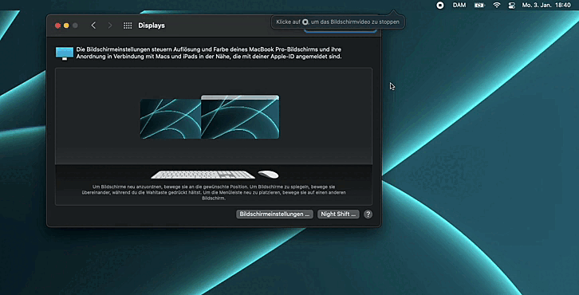

# display-arrange-manager (DAM)
A menu bar app that allows to store multiple display arrangements and switch between them.

# usage demo 

# TODOs
* add App Icon
* add AppleScript support
* improve quality of usage demo gif
